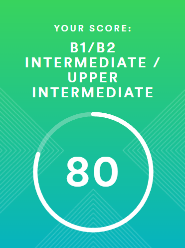

# Kate Potapenko

************

## My Contact Info

Name|Contact
-----------|:-------:
**Phone**|+375 29 169-96-40
**E-mail**|<katya.potapenlo.walk@mail.ru>
**GitHub**|kate-pure
**Telegram**|@tree_xx

************

## About Me

Although I don't have experience in Front development, I have a strong believe that I can learn anything I need to be a front developer. My goal - keep learning until I can find a job. My strengths are diligence, passion for development, patience.

************

## Skills

* HTML
* CSS
* In active learning

************

## Code examples

```
<fieldset>
   <legend>Front-end</legend>
   <label>HTML
    <input type="checkbox" name="front-end" value="html">
   </label>
   <br>
   <label>CSS
    <input type="checkbox" name="front-end" value="css">
   </label>
   <br>
   <label>JS
    <input type="checkbox" name="front-end" value="js">
   </label>
  </fieldset>
```

************

## Experience

************

## Education

* Vitebsk State Medical University
* RS Schools Course «JavaScript/Front-end. Stage 0» (in progress)

************

## Languages

* English - Intermediate/Upper-intermediate (according to the online [test](www.efset.org))



************